  # 僅僅用於個人展示 禁止商業用途 For personal demo only, commercial use prohibited.
  
 
  ### CAR PLATE TIME CACULATION (The Last Solution) 
  New energy parking spaces with the best timing plan(AI 車牌識別方案) C++(VIDEO),Python(AI),WEB APP(C#)
  
  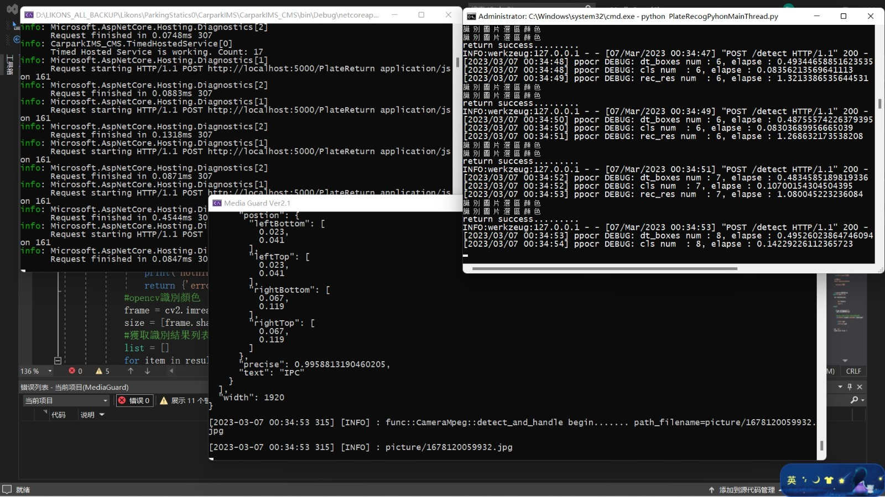)

  ### AI EVENT (Triger the swicth) AI BOX (Pyhton + VUE.JS)
  
    ---------[THIS IS TONY LAW]---------------------
  [mpeg] (/sample/AI_BOX1156_2.mp4)
  [政府指定垃圾袋 AI 解決方案 AI BOX EDGE COMPUTING]
   
   
   
   
   
  ### HIKVISON SYNC 海康數據同步
  
  
 ### It can be applied to all of Industies.

# Attendance and Salary System Bisic on Cloud 
                                              Architecture by Tony Law
 ----------------------------------------------------------------------------------------------
  
  
  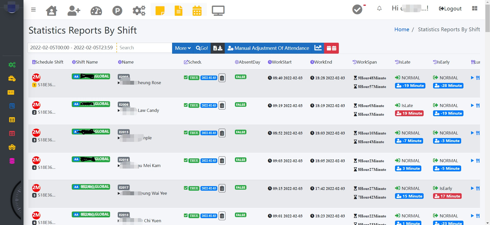
  
  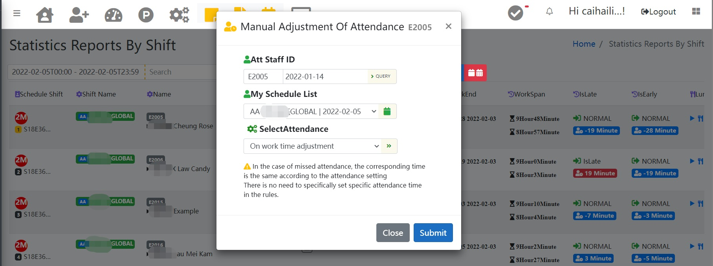
 
  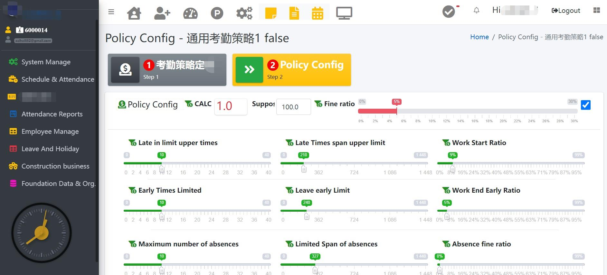
  
  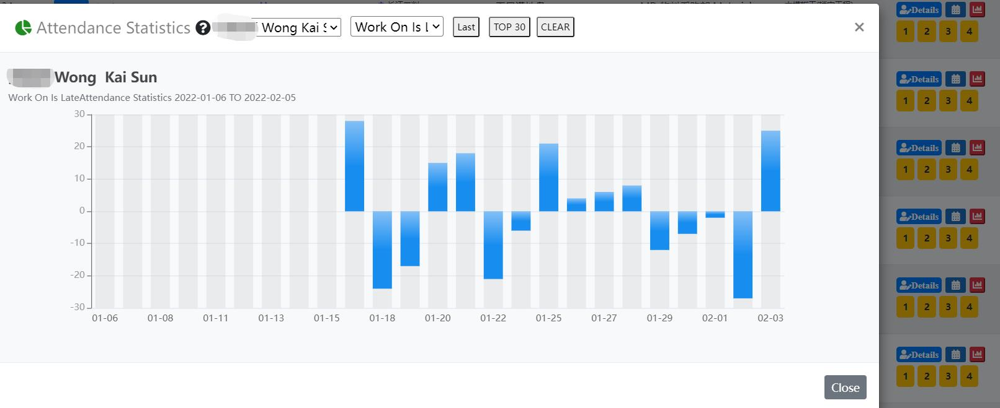
  
  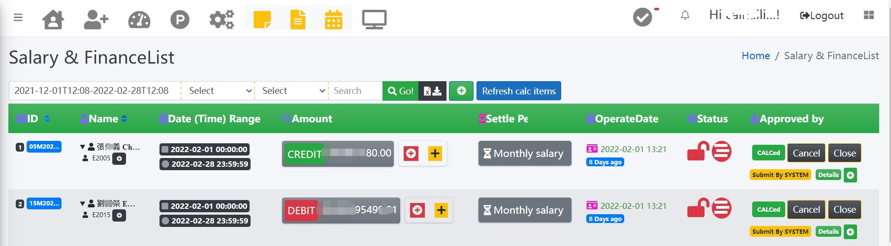                                         
###Overview of Attendance and Salary System Functions
### System Authority
Authority management and function appointment.
The highest authority SysAdmin system administrator is mainly to set up and authorize the entire system.
Administrator Admin Business administrator.
Special exclusive roles: Contractor branch/store manager/etc., Department: department manager Employee: data browsing on the employee’s mobile terminal, etc.

### Company organization and Foundation data
Department management, branch/chain store/contract tenant management,
Location management Describe and define specific locations. It is used for businesses that require location descriptions, such as equipment, chain stores, branches, etc., which have specific locations.
Position management Specific positions such as manager, employee, deputy manager
Work types management For relatively large companies, design cross-industry or in-depth industry work types.
Industry classification is mainly used for what industry the head office belongs to. Adjust specific page functions for the industry, such as real estate construction business,
It provides cloud data that connects to the government qualification certificate. For the medical industry, it will connect to the cloud data of the government health department for data connection
Public holiday management mainly provides standard holidays and sudden public holidays. Including salary ratios, such as three-time overtime pay at the end of the year.
Industry dictionary customization, all words in the corresponding system can be changed through the dictionary. Especially suitable for industry-specific terminology needs.
For example, hospitals, schools, etc. all have a set of terminology rules within the industry, which are very different from the general company system. The industry dictionary is aimed at the above situation.

### HR Management
It is mainly personnel records, which can start from the salary evaluation of the interview, entry, calculation of attendance, calculation of salary, data changes,
Data processing for a series of processes including resignation at the end. Add, update, and freeze employee profile picture, ID number, mobile phone number, entry and resignation date, card association, etc.
The list of employees is queried by department, job type, position, etc.
Associate and cancel system users (the front-end browsing use of employees, system users and employees are two completely different concepts, system users are used for system login and operating system, attendance personnel are employees and belong to the defined company employees)
Assigned to the device: Assign a specific device to attendance and download the profile picture and attendance number to the corresponding device (if applicable). Other equipment is invalid and entry is denied.
Shooting card association and association: Add and change the shooting card.
Work calendar view management, providing calendar reading, intuitive and simple.

### Leave System and Public Holiday System
Leave: Provide supplementary leave and leave. Is there a paid holiday, and so on. Asking for leave is to ask for leave according to the schedule,
For example: there is a schedule AA on October 26, and the leave should be based on this schedule, so that the system can calculate accurately.
Import public holidays, import holiday data in Excel format into the system, saving time and effort.

 Attendance Setting System
Provide day shift attendance settings and night shift attendance settings to meet the work requirements of different periods.
Flexible attendance can be set by scheduling (arrange working hours freely), and work on demand according to the needs of certain industries, for example: a researcher/professor/senior doctor,
Freely arrange two days within a week to complete two working days to meet the company's attendance requirements. You can set up shifts and declare by attendance personnel themselves to achieve the purpose of attendance calculation.

### Scheduling system
Shift scheduling is automatically run every month, including custom scheduling and global scheduling (fixed scheduling, commonly known as Chaojiu Evening Wu is one of the applications),
The custom schedule is short-term, and the priority is higher than the global schedule. Once there is a conflict, the global schedule will be replaced by the custom schedule.
The custom schedule can be manually scheduled, but the global schedule is scheduled to run on a monthly basis by the system.
The system's global schedule and freely adjustable schedules can solve the manpower work arrangement in an all-round way. Flexible and time-saving and labor-saving, no need to make complicated scheduling plans.

### System migration (personnel import)
Provide EXCEL format template to import data, and import data through API, and while importing, carry out the corresponding department and position
Organizational unit editing and so on, in order to multi-dimensional classification management of a large number of attendance personnel
For the introduction of holidays at the end of the year, the holiday system may not be the same for different companies. The holiday import function is provided here to smoothly transition to the new system.

###System dictionary comparison (language system)
Customize the words and sentences of each page to suit the requirements of the company’s culture and terminology.
For example, missed typing (missed sign) Another example: hospital departments become departments and so on, you can customize settings through the industry to adapt to the name of different industries.
At the same time, it provides interface requirements in simplified, traditional, and English, and other languages can be added as needed.

### Industry customization features
The attendance personnel are automatically imported through the government registered worker database. Currently, the attendance personnel import in the construction industry is provided. Others need to be targeted and open.

### Department Attendance Report
Provide report query for department managers, including schedule and attendance calculation report, daily attendance calculation report, monthly attendance calculation report,
Approval of leave of attendance staff and so on.
It includes functions such as exporting report data in Excel, PDF and other forms.

### Attendance reports in the form of branches, managers, store managers, agents, etc.
Provide report query for department managers, including schedule and attendance calculation report, daily attendance calculation report, monthly attendance calculation report,
Approval of leave of attendance staff and so on.
It includes functions such as exporting report data in Excel, PDF and other forms. The data of the report will only provide the corresponding data of the corresponding authority, which is safe and controllable. For example: Manager, provide the corresponding report of his subordinate members.

### Missed and supplemented attendance
Provides the function of remedy after the fact that you forgot to check in. And the rules and regulations of attendance records with in-and-out and out-and-out
And solutions.
Missing a attendance means forgetting to check in and actually go to work.
Supplementary attendance is to supplement the registration record based on the actual class situation.

### My attendance center
In the form of mobile phone or computer front-end, provide attendance personnel to query monthly reports, daily reports, shift reports, leave applications,
And other interactive functions.

### Reporting system
Provide report form EXCEL or PDF download.
The specific functions of the report are scattered in the corresponding specific business functions, such as the schedule and attendance report. The query includes the report download.

 Attendance report review
Provide list query of attendance data records, provide manual review records, foolproof. Including the recheck calculation of the schedule and attendance, it is foolproof.
For industries where attendance data is very important, provide record review processing, and use manual review calculations to check whether there are errors in computer reports. Guarantee absolute accuracy.

### Chart big data calculation
Chart big data calculation, based on the current advanced big data calculation ideas, use a variety of different statistical data expression forms to express data statistics,
For example, scatter statistics, visually show the area of late arrivals and distributed time periods. Follow-up data statistics mining will develop more functions.

### Salary system
 Salary assessment
Including salary evaluation for interview scenarios, employee salary evaluation, and salary evaluation for Junsheng application scenarios.

### Account classification
Including accounts for the four settlement cycles by year, month and day, and a separate account. Only after settlement will a new other account be created.

### Accounting items
The accounting items preset by the system, such as transportation allowance, meal allowance, etc.

### Additional accounting items
In addition to the preset accounting items, accounting items for specific personnel have also been added.
For example, the board of directors' remuneration for business managers, salesperson commissions, and so on. From preset accounting items to additional accounting items for specific personnel, complete coverage
Different changes.

### Accounting currency
Provide a variety of international currency options, such as Euro, Renminbi, U.S. dollar, British pound, Japanese yen, etc., which can be appropriately increased according to needs.

### Income tax
Impairment items, providing mixed calculation rules for fixed impairment items and ratio impairment items. Suitable for any situation.

### Financial accounts
Provide financial account query search list and extended links to other functions.

### Financial details item
Provide a list of financial details.

### Personal financial overview
Personal financial accounts and all detailed items are clear at a glance.

### CIC API 
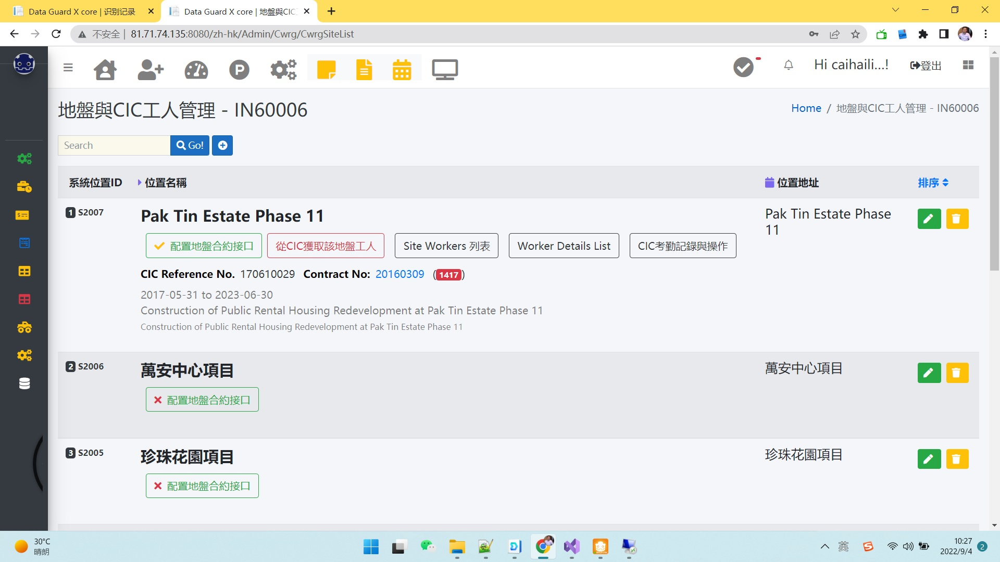
  

  
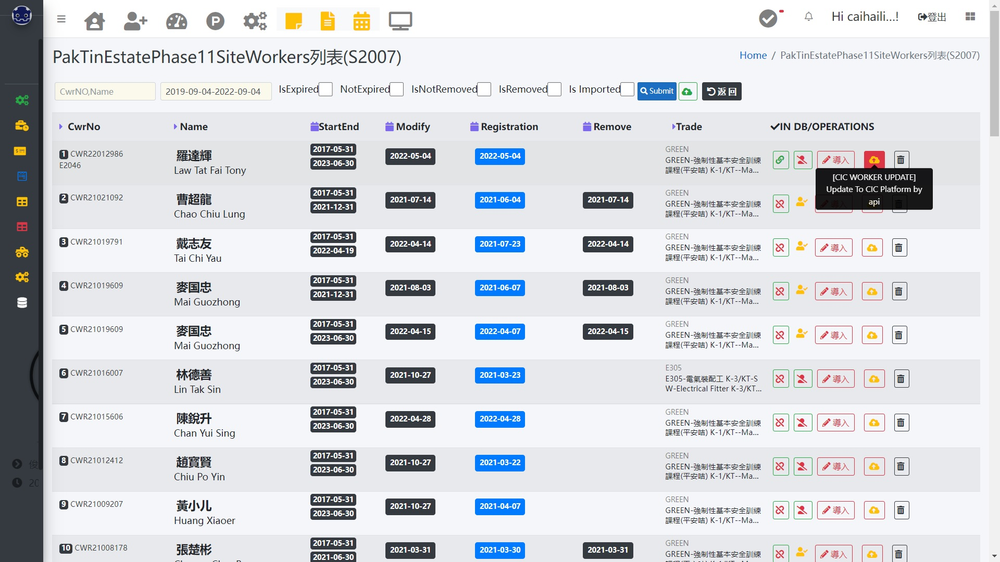
  
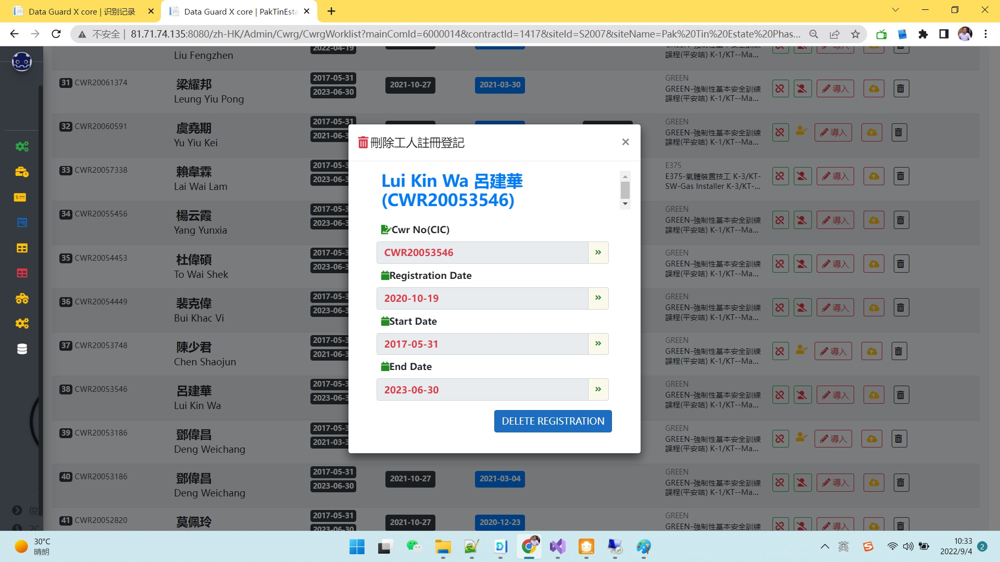

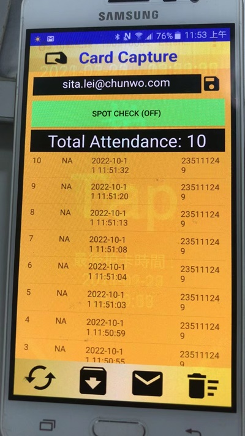

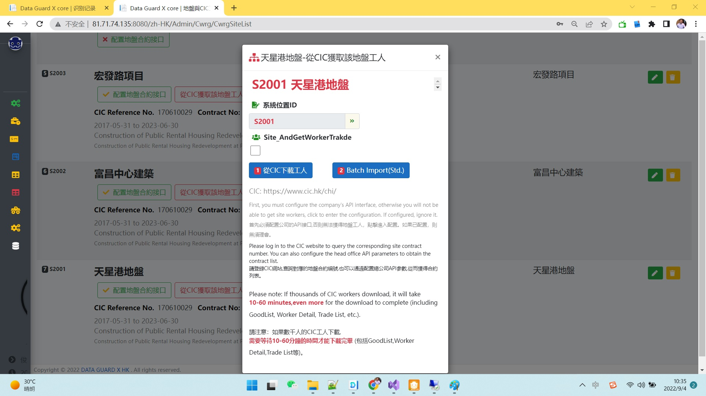

 
